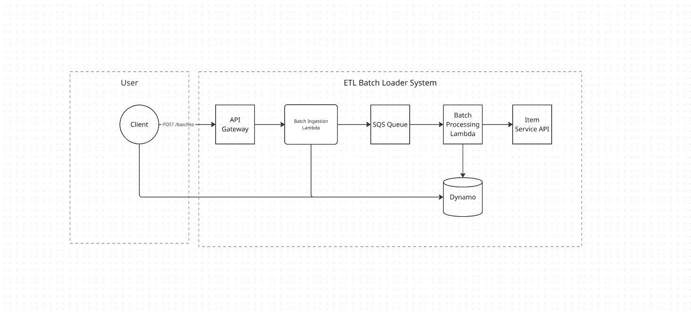
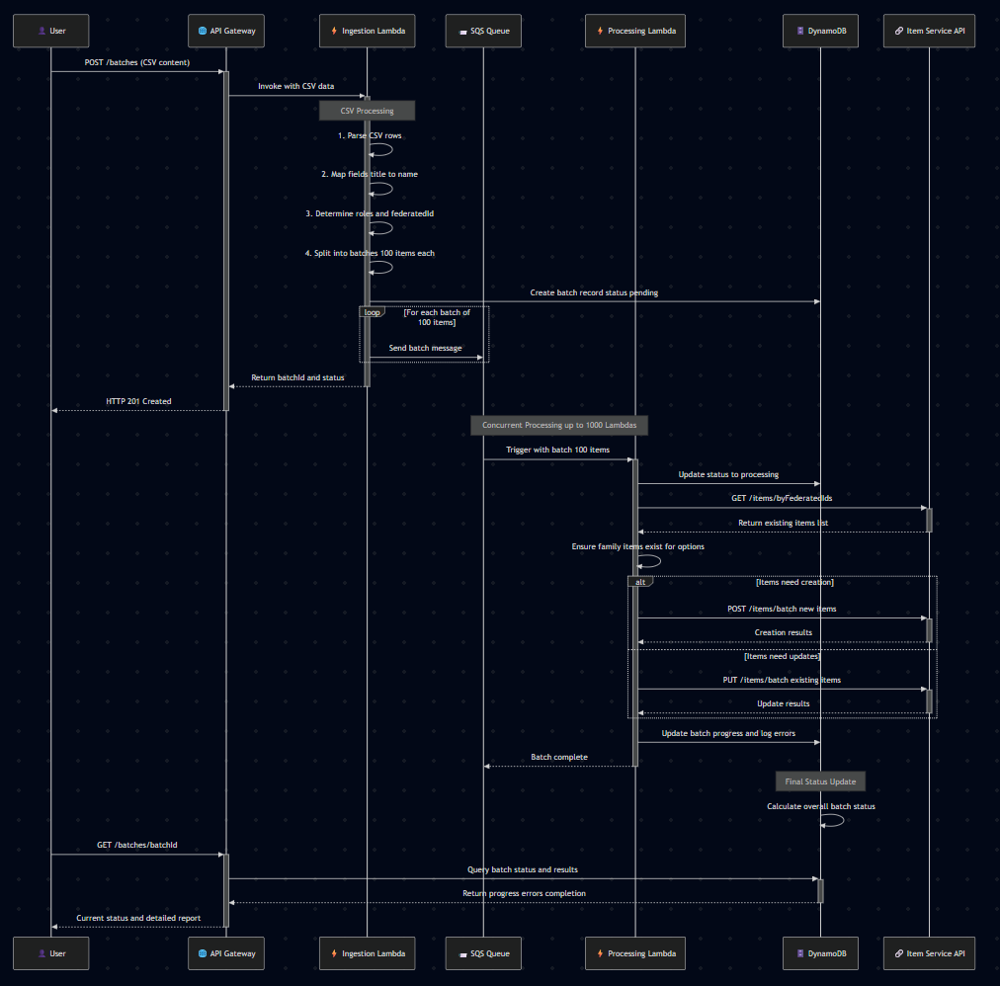
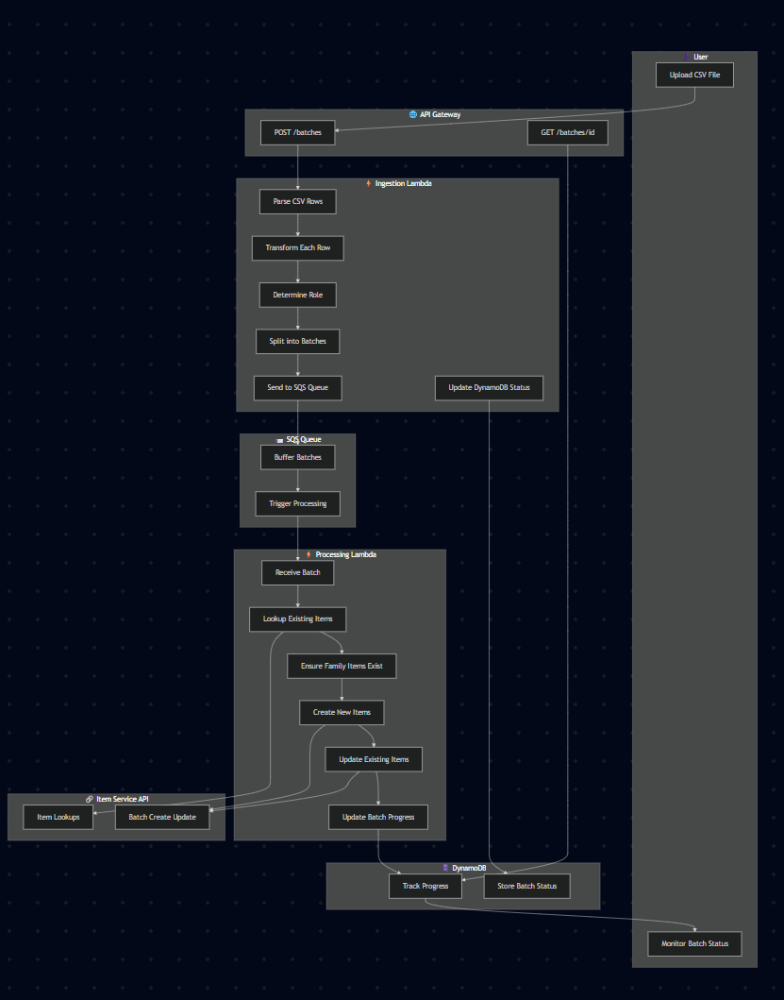

# ETL Batch Loader Design Document

---

## **Overview**

I have designed an ETL batch loader service to ingest, transform, and integrate up to 5 million items per day, supporting peak throughput of 5,000 items per minute and a maximum processing latency of 10 minutes per CSV. The solution is implemented in TypeScript, utilizing terraform as IAC, CI/CD pipeline through Github Actions, and hosted AWS Cloud Services.

### **1. Architecture**

#### **High-Level System Architecture**



_Figure 1: High-level view of the ETL Batch Loader system showing the main components and data flow between User, API Gateway, Lambda functions, SQS, DynamoDB, and the external Item Service API._

#### **Interactive Architecture Diagram**

For a detailed interactive view, visit: [Miro Board](https://miro.com/app/board/uXjVJcTvajo=/?share_link_id=162175946731)

### **Components**

- **API Gateway**
  - Exposes REST endpoints:
    - `POST /batches`: Accepts CSV uploads
    - `GET /batches/{batchId}`: Returns batch processing status and report

- **Lambda Functions**
  - **Batch Ingestion Lambda**:
    - Parses incoming CSV files
    - Transforms each row to the target item schema
    - Splits items into batches of up to 100 (API limit)
    - Publishes batches to SQS for processing
  - **Batch Processing Lambda**:
    - Triggered by SQS messages
    - Processes each batch concurrently (up to 1,000 at a time)
    - Makes necessary calls to the Item Service API (e.g., lookups, publishing, updating) to complete item integration
    - Handles errors and logs results

- **SQS**
  - Buffers batches for concurrent processing
  - Ensures reliable delivery and retry of failed batches

- **DynamoDB**
  - Stores batch status, processing results, and error reports
  - Enables reporting via API

### **Data Flow Diagram**



_Figure 2: Detailed sequence diagram showing the complete data flow from CSV upload through processing, including interactions between all system components and the external Item Service API._

#### **Swimlane Process Flow**



_Figure 3: Swimlane diagram illustrating the responsibilities and interactions of each system component throughout the ETL process, from initial CSV upload to final status reporting._

---

## **2. Data Transformation**

- **Input:** CSV file containing item data
- **Transformation:**
  - For each row in the CSV, I map and validate fields according to the Target Item Schema specified.
  - I ensure all required fields are present and correctly formatted.
  - If the transformation requires additional data or validation, I make calls to the Item Service API (for lookups, publishing, or updating).
- **Validation:**
  - I validate each item against the Target Item Schema.
  - I handle missing or invalid data according to the requirements.
- **Error Handling:**
  - Invalid rows are logged and excluded from batch submission.
  - Errors encountered during API calls or transformation are tracked and reported.

**CSV Input Format**

1. Each row in the CSV represents either a family or an option:
2. familyFederatedId (string, required): Identifies the family (product).
3. optionFederatedId (string, optional): Identifies the option (variant).
4. title (string): Name/title of the item.
5. details (string): Description/details of the item.
6. If optionFederatedId is present, the row is an option (variant).
   - If not, the row is a family (product).

**Target Item Schema (Output Format)**

Each item produced from the CSV should match this structure:

```json
{
  "id": "string",                // Internal system ID (looked up via API; not provided in CSV)
  "name": "string",              // Mapped from 'title'
  "description": "string",       // Mapped from 'details'
  "federatedId": "string",       // optionFederatedId if present, otherwise familyFederatedId
  "roles": ["option" | "family"] // ["option"] if optionFederatedId is present, otherwise ["family"]
}
```

- `id`: Internal system ID, retrieved via API lookup.
- `name`: Mapped from the CSV column `title`.
- `description`: Mapped from the CSV column `details`.
- `federatedId`: Uses `optionFederatedId` if present, otherwise `familyFederatedId`.
- `roles`: Array containing `"option"` if `optionFederatedId` is present, otherwise `"family"`.

---

## **Loader Responsibilities & Solution Implementation**

1. **Parse the CSV and Transform Each Row**  
   I will use a CSV parsing library (e.g., csv-parse for TypeScript).
   - For each row:
     - Map `title` → `name`
     - Map `details` → `description`
     - Determine `federatedId` and `roles` (see below).

2. **Determine Role and federatedId for Each Row**
   - If `optionFederatedId` is present:
     - `federatedId = optionFederatedId`
     - `roles = ["option"]`
   - If not:
     - `federatedId = familyFederatedId`
     - `roles = ["family"]`

3. **Lookup Existing Items via federatedId**
   - Collect all `federatedId` values from the transformed items.
   - Call `GET /items/byFederatedIds?federatedIds=...` to check which items already exist.
   - This determines whether to create or update each item.

4. **Create or Update Items in Batches**
   - Group items into batches of up to 100 (API limit).
   - For each batch:
     - If the item exists (from lookup), use `PUT /items/batch` to update.
     - If not, use `POST /items/batch` to create.
   - Handle API responses and errors.

5. **Ensure Families Exist**
   - For each option row, ensure its `familyFederatedId` exists as a "family" item:
     - If no item with that `familyFederatedId` exists and it’s not present in another row as a "family":
       - Create a "family" item with:
         - `federatedId = familyFederatedId`
         - `roles = ["family"]`
         - Default `name` and `description` if not provided

---

## **3. Assumptions & Clarifying Questions**

### **Assumptions**

- The Item Service API supports batch upserts of up to 100 items per request (API limit).
- Lambda concurrency limit is 1,000 (can be increased if needed).
- The downstream Item Service API and infrastructure can handle peak parallel load.
- CSV files are well-formed and do not exceed reasonable size limits: APIG has a 10MB API Limit so some assumptions are being made in this solution:
  - Byte Calculations
  - Example Row 1:
  1. nike-air-max = 12 bytes
  2. air-max-90 = 9 bytes
  3. Nike Air Max 90 = 14 bytes
  4. Iconic running shoe with waffle outsole and Max Air unit = 59 bytes
  5. Commas (3) = 3 bytes
  6. Line ending = 1-2 bytes
  7. Total: ~98-99 bytes
  - Per row estimate assumption ~80-120 bytes
  - 5k items is 400KB - 600KB
  - 50k items is 4MB - 6MB
  - 500k items is 40MB - 60MB
  - 5M items is 400MB - 600MB
  - At 5k items/minute ~100 bytes/row = ~500KB per batch. So currently Iam safe in the 10MB API Gateway limit. I would change this to S3 upload if very large files were to be used.
- Authentication and authorization are handled at API Gateway.
- Only CSV format is accepted for ingestion; JSON is not supported unless clarified by stakeholders.

### **Clarifying Questions for Stakeholders**

1. What is the maximum batch size supported by the Item Service API? 100 confirmed?
2. Are there any rate limits or throttling on the Item Service API?
3. What error formats should be returned to users?
4. Should partial successes (some items succeed, some fail) be reported per batch?
5. Are there specific validation rules for item data beyond the Target Item Schema?
6. Is there a maximum file size or item count per upload?
7. What are the security requirements for API endpoints? I will default to open for this use case.
8. Should failed batches be retried automatically, or require manual intervention? I would default to automatically.
9. Is JSON or any format other than CSV acceptable for ingestion?
10. Are there any specific audit or logging requirements for item ingestion and processing?
11. Should the loader support partial updates to items, or must all fields be provided on update?
12. What is the expected behavior if duplicate federatedIds are found in the same CSV?
13. Are there any constraints on the allowed characters or formats for federatedId, title, or details?
14. Should the loader support rollback or compensation logic if a batch fails after partial success?
15. Is there a required SLA or notification process for failed batches or ingestion errors?
16. If I were to include a persist; are there any requirements for data retention or purging in DynamoDB/reporting storage?
17. Should the loader support multi-tenancy or handle data segregation for different clients? I will default to no.
18. Are there any requirements for internationalization or localization of item names/descriptions?
19. Should the loader validate relationships between options and families beyond federatedId matching?
20. Could this product be extended to different integration protocols? Should this system be designed to be decoupled from HTTP API as sole integration layer?
21. Could this product be designed to include data ingestion from other company data sets or persistent layers. Example: Ingestion from flat files store in s3.

---

## **4. Batching and Concurrency Strategy**

### **Requirements**

- Up to 5 million item ingestions per day
- Peak throughput: 5,000 items per minute
- Maximum acceptable processing latency: 10 minutes per CSV

---

### **Batch Size Selection**

- **Batch Size Chosen:** 100 items per batch (API limit)

#### **Math & Justification**

**Daily Requirement Breakdown:**

- 5,000,000 items/day ÷ 24 hours ÷ 60 minutes ≈ 3,472 items/minute (average)
- Peak: 5,000 items/minute

**Batches per Minute:**

- 5,000 items/minute ÷ 100 items/batch = **50 batches/minute**
- 3,472 items/minute ÷ 100 items/batch ≈ **35 batches/minute (average)**

**Lambda Concurrency Limit:** 1,000 (default)

**Maximum Parallel Items:**

- 1,000 batches × 100 items = **100,000 items in parallel**

**Maximum Items per Day:**

- 100,000 items/min × 60 × 24 = **144,000,000 items/day**

**Conclusion:**  
With a batch size of 100, the system still exceeds the required throughput and daily ingestion rate by a wide margin.

---

### **Concurrency Strategy**

- I process batches in parallel, up to 1,000 concurrent Lambdas.
- If more than 1,000 batches are queued, SQS buffers until Lambdas are available.
- Failed batches are retried independently; persistent failures are logged for reporting.
- Each Lambda invocation processes a single batch of up to 100 items, ensuring compliance with the Item Service API limit.
- Lambda concurrency can be tuned based on observed throughput, downstream API rate limits, and AWS account limits.
- I monitor Lambda execution time and error rates to dynamically adjust concurrency and batch submission rates if necessary.
- SQS provides durability and ordering guarantees, ensuring no data loss and that batches are processed in the order received.
- I implement exponential backoff and jitter for retries to avoid overwhelming the Item Service API during transient failures.
- Dead-letter queues (DLQ) are configured for SQS to capture batches that fail repeatedly, enabling manual inspection and remediation.
- Metrics and alerts are set up for Lambda invocations, SQS queue depth, batch failures, and API response times to proactively manage

---

## **Summary**

This design iteration provides a robust, scalable solution for high-volume item ingestion and integration, with clear batching and concurrency strategies, thorough data transformation logic based on the Target Item Schema and Loader Responsibilities, and comprehensive error handling and reporting.  
Theoretical throughput far exceeds requirements, ensuring reliability and future scalability.

As always, open to solution modification, and feedback. Thanks for reviewing!

---

**End of Document**
